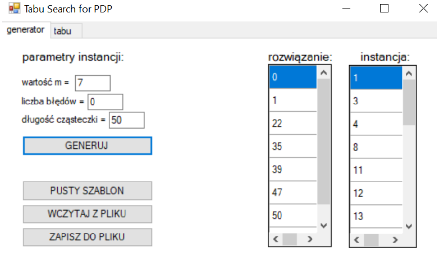

# PDP MAX MATCH problem

The proposed algorithm is a **metaheuristic** solution for the **partial digestion problem**, which involves an experiment on a DNA molecule. Copies of the molecule in question are digested (cut) with a restriction enzyme in different time intervals. Consequently, the samples with longer digestion time will be more fragmented, and the ones with shorter exposure, will remain more intact. Ideally, this type of experiment would result in a multiset of all possible distances between the cutting sites (with "cutting sites" we also include both ends of the molecule). Based on this multiset, it is possible to reconstruct a map of all cuts (places where the enzyme cuts the molecule). So **the input is a multiset of distances, and the solution is the map of restriction sites**.

Below you can see an example representation of a partial digestion experiment:

so in this case: 
- the multiset would be as follows: {4, 8, 8, 12, 16, 20}
- the restriction map would be as follows: {0, 4, 12, 20}

However, in reality, it is highly unlikely that we would get a perfectly correct multiset. Various versions of this problem assume different errors in the data - here we focus on one of them. The **MAX MATCH** variant of PDB corresponds to a situation, where some fragments were not correctly measured, resulting in substitutions in the multiset. Since no other types of errors are allowed in this variant, the multiset should always have **m choose 2** elements, where m is the number of cuts + 2 ends of the molecule.

The **optimal solution** is a map, for which the corresponding multiset has a maximum amount of matching elements with the input multiset.

Since the approach proposed here is a based on a **Tabu Search implementation** it does not guarantee finding an optimal solution. 

# Download and usage

This program is a Windows Forms application. No external tools are needed to run it - just download pdp-app.exe and run it:

➡️ **[Download the latest version](https://github.com/a-dzik/tabu-search-for-partial-digestion/releases/latest)**  

## Input instance generator

As shown in the example, the input multiset can be easily obtained from a (randomly generated) solution map. This is achieved by computing distances between all possible pairs of restriction sites. Then, for this specific variant of the problem, a user-defined number of substitution errors is introduced to the input multiset.

All of the instance parameters can be adjusted using the **generator tab** of the program:
- m value (number of restriction sites),
- number of errors,
- total molecule length.
  

The generated map and multiset are displayed in the form, and individual elements can be edited; keep in mind that the program will only accept a correct input instance before moving into the next step.

## Tabu search algorithm implementation

There are 4 user-defined parameters for the tabu implementation, which can be adjusted in the second tab:

- tabu list length,
- neighbourhood size (number of solutions generated in ieach iteration),
- maximum number of iteration with no improvement before reset,
- maximum runtime.

The parameters can be adjusted after already starting the computations as well. 

The form displays the objective function starting and best values. The best found solution (map) is also presented.
